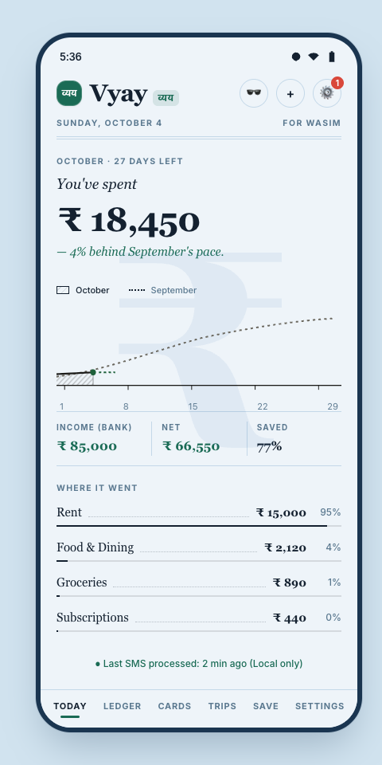
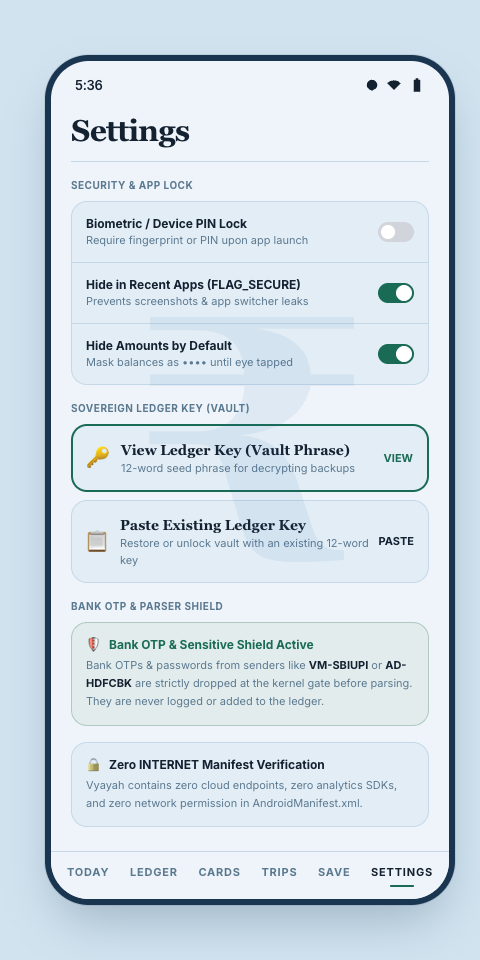

# About Vyay (व्यय)

> *"If you are not paying for the product, you are not just the product — in fintech, your entire net worth is the product."*

---

## 📖 The Origin Story

Over the last decade, personal expense trackers underwent a silent, insidious transformation. What started as simple digital checkbooks turned into bloated surveillance apparatuses.

Today, downloading a mainstream expense tracker in India or elsewhere requires:
1. Creating an account linked to your phone number and Google profile.
2. Granting continuous SMS permissions to third-party cloud servers.
3. Consenting to lengthy privacy policies that permit companies to analyze your spending habits, derive your credit score, calculate your monthly income, and syndicate that profile to underwriters, loan aggregators, and credit card issuers.

When you buy a coffee or pay your rent, that transaction is analyzed, categorized on external servers, and leveraged to target you with pre-approved personal loans, insurance pitches, and gamified scratchcards designed to extract more engagement.

**Vyay (व्यय)** was built as an antidote to this status quo.

The word **व्यय** (Vyaya) is Sanskrit for expenditure or spending. Our core belief is simple: **Understanding your spending should bring clarity, not subject you to constant surveillance.**

---

## 🛡️ The "Zero-Internet Guarantee"

Most apps promise privacy in a marketing statement, but their app manifests still declare:
```xml
<uses-permission android:name="android.permission.INTERNET" />
```

Once that permission is granted, you must blindly trust that the app's developers, SDKs, analytics trackers, and advertisers won't transmit your data.

In **Vyay**, we solved this at the kernel level: **we simply removed the `INTERNET` permission from `AndroidManifest.xml` entirely.**

### What Does This Mean Under the Hood?
On Android, permissions are enforced by the Linux kernel using Linux user IDs (UIDs) and network namespaces:
* When an app does not request `android.permission.INTERNET`, the Android OS **never creates network sockets** for that application.
* Even if an external library, malicious dependency, or rogue SDK tried to call `java.net.HttpURLConnection`, `OkHttp`, or open a raw socket, the Linux kernel **instantly rejects the system call with a permission failure**.
* The app **cannot** phone home. It cannot transmit telemetry. It cannot display third-party advertisements. It cannot download remote tracking configurations.

---

## 🔒 Threat Modeling & The OTP Security Shield

The primary hesitation people have with SMS-based expense trackers is:  
**"Can the app see my bank OTPs and passwords?"**

We addressed this with a multi-layered security shield:

### 1. Gatekeeper Filtration
Before an incoming SMS message is processed by any categorization or parsing engine, it passes through `SmsFilter.kt`. If the message contains authentication keywords (e.g., `OTP`, `one time password`, `verification code`, `secret code`, `do not share`), **the payload is dropped at the gate**. It is never parsed, never logged, and never written to SQLite.

### 2. Zero Network Capability
Even in the theoretical event of an unhandled transaction SMS containing sensitive information, **it cannot leave the device**. There is no network pipe to exfiltrate data.

### 3. Biometric & `FLAG_SECURE` Defense
* **App Lock:** You can lock Vyay behind your device's biometric authentication (fingerprint/face recognition) or PIN.
* **App Switcher Masking:** All app activities enable `WindowManager.LayoutParams.FLAG_SECURE`. When you switch apps, the Android OS blurs or blacks out the app snapshot, preventing other apps or shoulder surfers from glancing at your ledger.

---

## 🔐 Cryptographic Storage Architecture

All financial data stored in Vyay is shielded by two layers of hardware-assisted cryptography:

1. **Android Hardware Keystore:**  
   During initial setup, Vyay generates an AES-256 encryption key inside the Android Hardware Security Module (HSM / StrongBox Keymaster). The key material never leaves hardware enclave memory.
2. **SQLCipher Database Encryption:**  
   The underlying SQLite Room database is encrypted page-by-page using 256-bit AES encryption via SQLCipher. Even if someone physically extracts an unencrypted device backup, the database file remains unreadable without the Keystore key.

---

## 🎨 The Newsprint Paper Aesthetic

Vyay deliberately eschews the neon-purple gradients, confetti animations, and gambling-style scratchcards popularized by modern fintech apps.

Instead, Vyay’s interface is modeled on **high-end financial journalism and editorial broadsheets** (inspired by *The Financial Times*, *Bloomberg*, and classic newsprint):

* **Parchment Light Mode:** Warm, natural cream paper tones (`#F7F4EC`) that reduce eye fatigue during daytime audits.
* **Ink Dark Mode:** Deep charcoal paper tones (`#141413`) with subtle forest green accents (`#1E613B`) and muted borders for comfortable evening reviews.
* **Typography-First Hierarchy:** Crisp, clean editorial numbers that display your financial reality without judgment or emotional manipulation.

<div align="center">
<table>
  <tr>
    <td align="center" width="50%"><b>Editorial Today Dashboard</b></td>
    <td align="center" width="50%"><b>Hardware Security & OTP Shield</b></td>
  </tr>
  <tr>
    <td align="center"></td>
    <td align="center"></td>
  </tr>
</table>
</div>

---

## 🗺️ Product Roadmap

- [x] On-device bank SMS parsing (HDFC, SBI, ICICI, Axis, Kotak, PNB, BoB, etc.)
- [x] UPI transaction detection (GPay, PhonePe, Paytm, CRED, Amazon Pay)
- [x] Zero-Internet architecture
- [x] Paced budgets with WorkManager threshold alerts (80% / 100%)
- [x] Ring-fenced Trip Mode for travel expenses
- [x] Account and Credit Card limit utilization tracking
- [x] Biometric Lock & `FLAG_SECURE` screen shielding
- [x] Offline Excel (.xlsx) export via Apache POI
- [ ] Custom user regex rule builder for international banks
- [ ] Local encrypted backup / restore via SAF (Storage Access Framework)
- [ ] Split-expense calculator for group trips without network sync
- [ ] Desktop / Web companion via local encrypted export viewer

---

## 💬 Frequently Asked Questions (FAQ)

### Q: Why isn't Vyay on the Google Play Store?
Google Play policies have made it difficult for independent developers to publish utility apps requesting `RECEIVE_SMS` without mandating proprietary cloud features or undergoing expensive enterprise verification. Furthermore, Play Store distributes automated tracking binaries that contradict our zero-telemetry mission. Sideloading via **Obtainium** or GitHub Releases keeps Vyay 100% independent, uncensored, and autonomous.

### Q: Will Vyay drain my battery?
No. Vyay does not run continuous polling services in the background. It only wakes up for fractions of a millisecond when an SMS broadcast is received by the Android OS, processes the transaction, and returns to sleep.

### Q: Does Vyay support banks outside of India?
Currently, our built-in regex templates are tailored for Indian banks and UPI ecosystems. However, the parser engine is modular, and we welcome contributions for banks worldwide!

---

<div align="center">
  <b>Own your financial data. Reclaim your digital sovereignty.</b><br/>
  <a href="README.md">← Back to Overview</a> &nbsp;|&nbsp; <a href="https://github.com/dot-wasim/Vyay/releases">Download APK</a>
</div>
