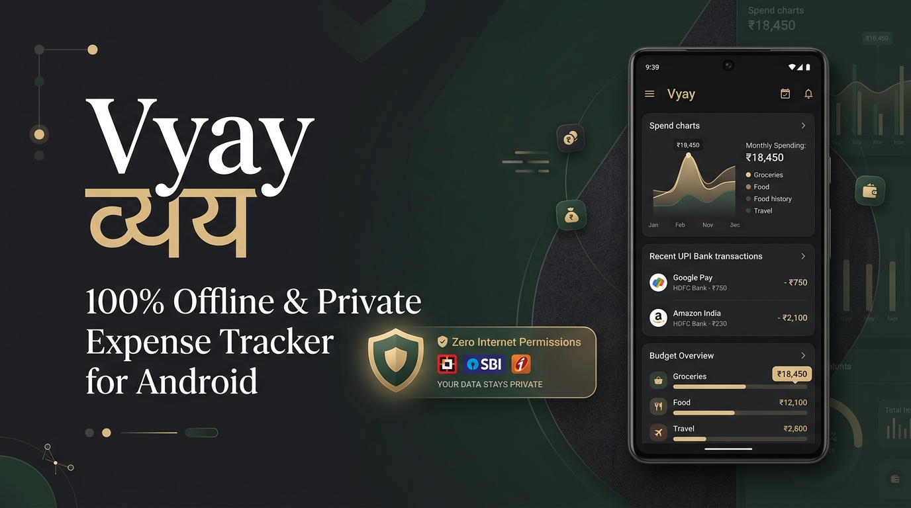
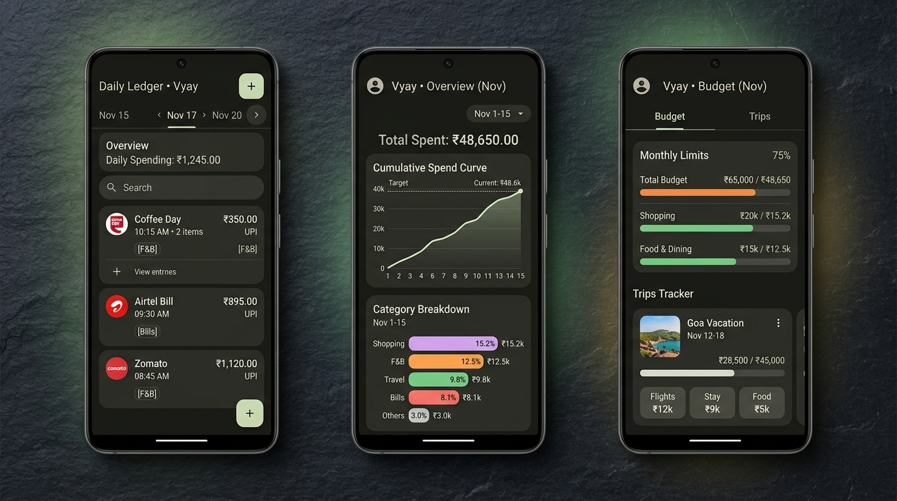
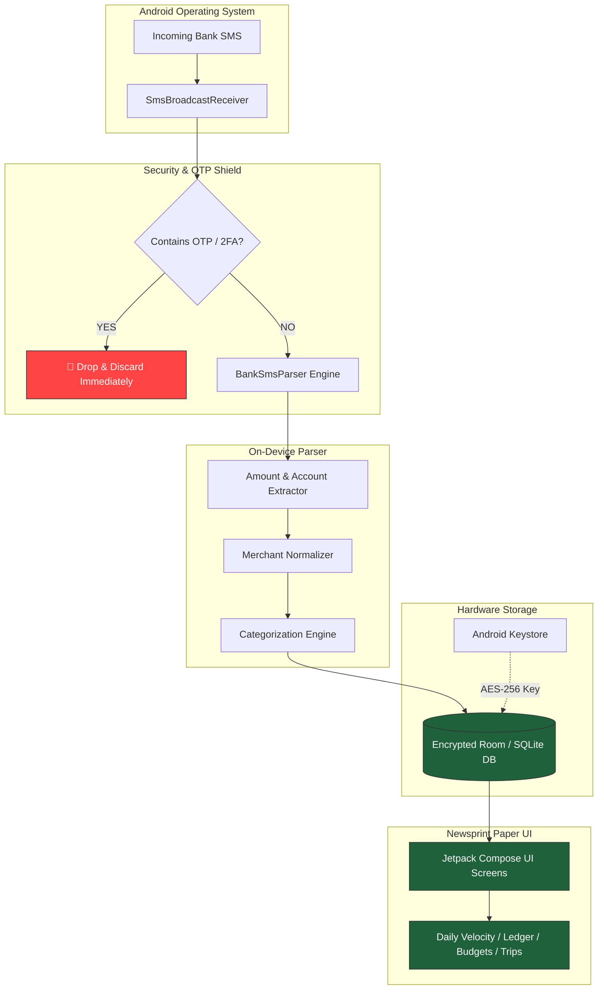

<div align="center">



# Vyay (व्यय)
### The 100% Offline, Privacy-First Personal Finance Tracker for Android

[](https://github.com/dot-wasim/Vyay)
[](https://kotlinlang.org/)
[](https://developer.android.com/jetpack/compose)
[](file:///ABOUT.md#the-zero-internet-guarantee)
[](https://github.com/dot-wasim/Vyay#method-1-seamless-auto-updates-via-obtainium-recommended)
[](https://github.com/dot-wasim/Vyay/releases)
[](file:///LICENSE)

<br/>

**Your money. Your device. Zero cloud. Zero trackers.**  
*Automatic SMS expense tracking engineered for total autonomy.*

<p align="center">
  <a href="https://github.com/dot-wasim/Vyay/releases/latest/download/vyay-app.apk">
    
  </a>
  &nbsp;&nbsp;
  <a href="https://github.com/dot-wasim/Vyay#method-1-seamless-auto-updates-via-obtainium-recommended">
    
  </a>
  &nbsp;&nbsp;
  <a href="ABOUT.md">
    
  </a>
</p>

</div>

---

## ⚡ The Problem: Why Commercial Trackers Can't Be Trusted

Most popular expense tracking apps (CRED, Walnut/Axio, Fold, Money Lover) are **surveillance tools disguised as budgeting utilities**:

1. **They read your financial SMS and upload them to cloud servers.**
2. **They build behavioural credit profiles** and monetize your data to sell personal loans, credit cards, and insurance.
3. **If their servers get breached, your complete net worth and transaction history leak.**
4. **They spam you** with credit score alerts, lottery scratchcards, and loan notifications.

---

## 🛡️ The Vyay Guarantee

**Vyay (व्यय)** was built on an uncompromising principle: **Financial privacy is a fundamental human right.**

* 🚫 **Physically Zero Internet:** The `android.permission.INTERNET` permission is **completely removed from the manifest**. The Android OS kernel makes it physically impossible for Vyay to make network requests or phone home.
* ⚡ **Real-Time On-Device Parsing:** Bank SMS and UPI debit/credit notifications are captured instantly on-device using regex engines with zero latency.
* 🔒 **Ironclad OTP Shield:** Strict gatekeeping ensures authentication OTPs and 2FA passwords are filtered out before touching disk or memory.
* 🔐 **Hardware-Backed Encryption:** Your ledger database is encrypted with SQLCipher using keys stored in the Android Hardware Keystore.
* 📰 **Financial Times Editorial Design:** Modern Material Design 3 rendered in a bespoke *Parchment & Ink* editorial aesthetic — crafted for clarity and calmness, not casino gamification.

---

## 📱 App Experience

<div align="center">
  
</div>

---

## ✨ Features That Put You In Control

### 1. ⚡ Instant Bank & UPI SMS Extraction
* Detects debits, credits, refunds, and ATM withdrawals the exact second the bank SMS arrives.
* Built-in support for all major Indian banks: **HDFC, SBI, ICICI, Axis, Kotak, PNB, Bank of Baroda, IndusInd, Canara, Union Bank, and IDFC First**.
* Seamless parsing for **UPI applications** (Google Pay, PhonePe, Paytm, CRED, Amazon Pay, BHIM).
* Smart Merchant Normalizer cleans raw transaction text (e.g. `UPI/CR/4231.../SWIGGY` $\rightarrow$ `Swiggy`).

### 2. 📊 Spending Velocity & Burn Curve
* **Daily Spend Velocity:** Know your daily burn rate at a single glance.
* **Cumulative Spend Curves:** Visual trajectory charts compare your month-to-date spending against your target monthly pace.
* **Smart Categorization:** On-device category classifier assigns transactions into Food & Dining, Groceries, Shopping, Travel, Bills, and Healthcare without transmitting data anywhere.

### 3. 🎯 Paced Budgets & Local WorkManager Alerts
* Set granular monthly budgets across custom categories.
* Background WorkManager monitors spending pace and triggers gentle local alerts at **80%** and **100%** thresholds.
* No nagging ads, no upsells — just timely warnings before you blow your budget.

### 4. 🏖️ Ring-Fenced Trip Mode (Travel & Groups)
* Going on a vacation or road trip with friends? Activate **Trip Mode**.
* Travel flights, hotel stays, and group dinners are siloed into a dedicated Trip ledger so they **never skew your regular monthly grocery and living budgets**.
* Export trip expenses cleanly when you get back.

### 5. 💳 Account & Credit Card Utilization Tracking
* Monitor savings account balances, wallets, and multiple credit cards in one place.
* Track credit limit utilization ratios and bill due dates automatically from bank SMS.

### 6. 🔐 Hardware Biometrics & App Switcher Masking
* Protect your financial records with **Fingerprint / Face Biometric Unlock** or device PIN.
* Equipped with Android `FLAG_SECURE` so sensitive numbers and balances are masked in the recent apps switcher and protected against background screenshot grabbers.

### 7. 📑 Privacy-First Excel / Ledger Export
* Export your clean ledger anytime to **Microsoft Excel (.xlsx)** or CSV with full metadata.
* Use it for tax filing, personal audits, or import into your local spreadsheets.

---

## 📊 Comparison: Vyay vs. The Alternatives

| Feature | Vyay (व्यय) | CRED | Axio / Walnut | Fold Money |
| :--- | :---: | :---: | :---: | :---: |
| **Internet Permission** | ❌ **NONE (0 KB)** | ✅ Required | ✅ Required | ✅ Required |
| **Cloud Servers / Telemetry** | ❌ **Zero** | ☁️ Everything Uploaded | ☁️ Everything Uploaded | ☁️ Everything Uploaded |
| **Ad-Free & Loan-Free** | ✅ **100% Clean** | ❌ Loan Ads & Scratchcards | ❌ Credit Lines & Ads | ❌ Subscription / Cloud |
| **Instant SMS Parsing** | ✅ On-Device | ✅ Cloud Parsed | ✅ Cloud Parsed | ✅ Cloud Parsed |
| **Bank OTP Shield** | ✅ **Filtered at Gate** | ⚠️ Reads All | ⚠️ Reads All | ⚠️ Reads All |
| **Open Source** | ✅ **Yes** | ❌ Closed Source | ❌ Closed Source | ❌ Closed Source |
| **Offline Biometric Lock** | ✅ Hardware Keystore | ⚠️ Account Bound | ⚠️ Account Bound | ⚠️ Account Bound |
| **Cost** | 🟢 **100% Free** | Monetizes You | Monetizes You | Paid / Freemium |

---

## 🏗️ Architecture & How It Works



---

## 📥 Installation & Setup

### Method 1: Seamless Auto-Updates via Obtainium (Recommended)

[Obtainium](https://github.com/ImranR98/Obtainium) gives you smooth, seamless updates directly from GitHub Releases without requiring Google Play Store:

1. Download and install **[Obtainium](https://github.com/ImranR98/Obtainium/releases)** on your Android device.
2. Open Obtainium and tap **Add App (+)**.
3. Paste the repository URL:
   ```text
   https://github.com/dot-wasim/Vyay
   ```
4. Tap **Add**. Obtainium will download the latest APK, verify it, and notify you automatically whenever new releases are tagged!

---

### Method 2: Direct APK Download

1. Head to the **[Releases](https://github.com/dot-wasim/Vyay/releases)** page.
2. Download the latest `vyay-app.apk`.
3. Tap the file in your notification bar or file manager to install.

---

### ⚙️ Important Setup Steps for Smooth Background Tracking

#### 1. Android 13, 14 & 15: Sideload Restricted Settings
On newer Android versions, sideloaded applications require one-time approval before granting SMS access:
1. Long-press the **Vyay** app icon on your home screen $\rightarrow$ tap **App info** (ℹ️).
2. Tap the **three dots (⋮)** in the top-right corner.
3. Select **Allow restricted settings** and authenticate with your fingerprint or PIN.
4. Open Vyay and grant the SMS permission.

#### 2. OEM Battery Optimization (Xiaomi, OnePlus, Realme, Vivo, Samsung)
Aggressive OEM battery killers can terminate background SMS receivers. To guarantee instant capture:
* **Autostart / Background Launch:** Set to **Allowed** in *App Info $\rightarrow$ Permissions*.
* **Battery Usage:** Select **Unrestricted / No restrictions**.
* **Lock in Recent Apps:** Open the app switcher, long-press Vyay, and tap the **Lock** icon.

---

## 🔍 How to Verify the "Zero-Internet" Claim Yourself

Don't trust our words — verify with code:

### 1. Inspect the Manifest
Examine [`app/src/main/AndroidManifest.xml`](file:///app/src/main/AndroidManifest.xml). Notice that `android.permission.INTERNET` is **completely absent**.

### 2. Verify the Compiled APK
Run Google's official Android SDK APK Analyzer on the downloaded release:
```bash
apkanalyzer manifest permissions vyay-app.apk
```
**Output:**
```text
android.permission.RECEIVE_SMS
android.permission.READ_SMS
android.permission.POST_NOTIFICATIONS
android.permission.USE_BIOMETRIC
```
Notice `android.permission.INTERNET` is nonexistent. Android OS sandboxing will terminate any process that attempts to open a network socket without this permission.

---

## 🛠️ Tech Stack & Libraries

* **Language:** 100% Modern [Kotlin 2.0](https://kotlinlang.org/)
* **UI Framework:** [Jetpack Compose](https://developer.android.com/jetpack/compose) with Material Design 3
* **Local Persistence:** [Room](https://developer.android.com/training/data-storage/room) with [SQLCipher](https://www.zetetic.net/sqlcipher/) encryption
* **Background Tasks:** [WorkManager](https://developer.android.com/topic/libraries/architecture/workmanager) for proactive spending pacing & budget alerts
* **Architecture:** Clean Architecture + MVVM + Unidirectional Data Flow (StateFlow)
* **Dependency Injection:** [Koin](https://insert-koin.io/)
* **Security:** [AndroidX Biometric](https://developer.android.com/jetpack/androidx/releases/biometric) + [AndroidX Security Crypto](https://developer.android.com/jetpack/androidx/releases/security)
* **Report Generation:** [Apache POI](https://poi.apache.org/) for native offline Excel exports

---

## 💻 Building from Source

```bash
# 1. Clone the repository
git clone https://github.com/dot-wasim/Vyay.git
cd Vyay

# 2. Build the debug APK
./gradlew assembleDebug

# 3. Install on your connected device
./gradlew installDebug
```

---

## 🤝 Contributing

Contributions are warmly welcome! Whether you are adding regular expressions for local regional banks, refining the newsprint color tokens, or optimizing SQLite query performance:

1. Fork the Project.
2. Create your Feature Branch (`git checkout -b feature/NewBankSupport`).
3. Commit your Changes (`git commit -m 'feat: add support for Bank of Maharashtra SMS'`).
4. Push to the Branch (`git push origin feature/NewBankSupport`).
5. Open a Pull Request.

---

## 📄 License

Distributed under the **Apache License 2.0**. See [`LICENSE`](file:///LICENSE) for more details.

---

<div align="center">
  <sub>Built with ❤️ for people who believe their financial data belongs only to them.</sub>
</div>
